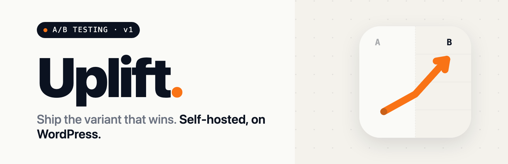
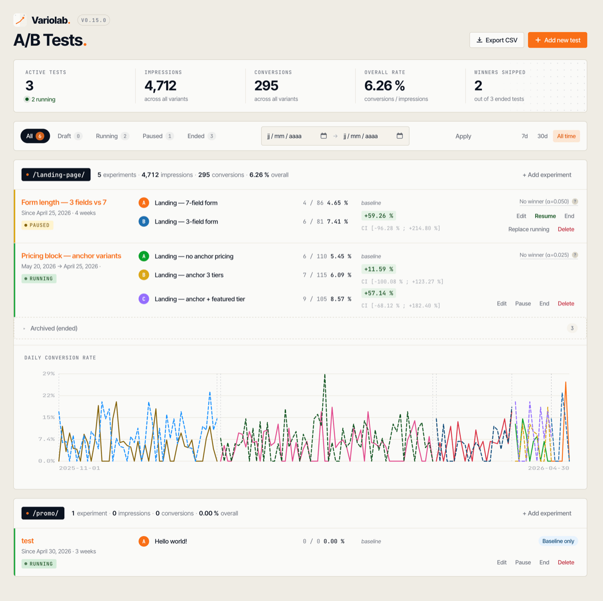
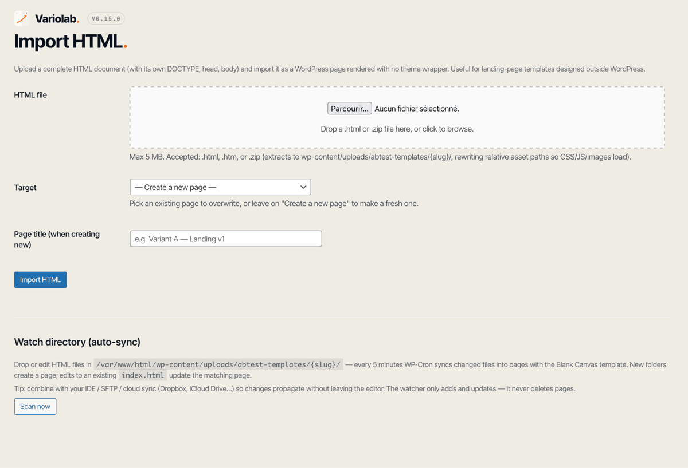
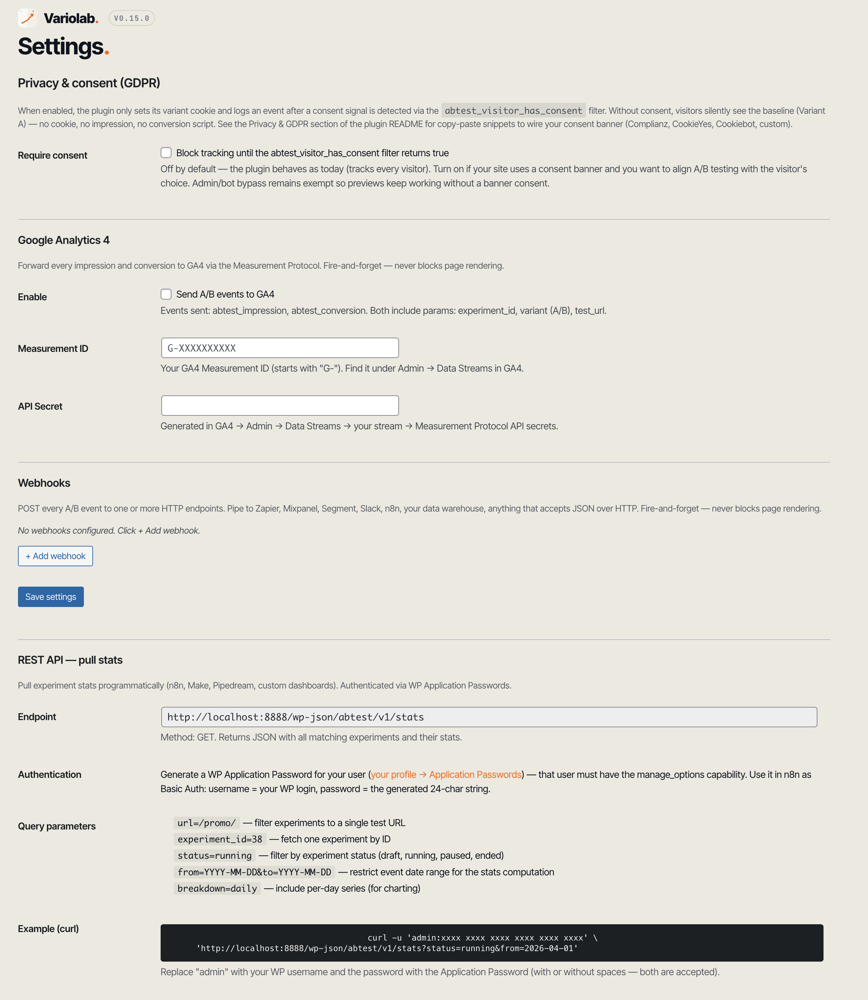

# Uplift – A/B Testing

[](https://github.com/lozit/uplift-ab-testing/actions/workflows/ci.yml)
[](./docs/security/latest.md)
[](./LICENSE)
[](#)
[](#)

<p align="center">
  
</p>

Uplift is a self-hosted A/B testing plugin for WordPress. Test landing pages, compare conversion rates, and pipe events to your analytics stack — all on your own database, no third-party dependency required.

Built around three core ideas:

- **URL is the unit** — each test attaches to a URL path (`/promo/`, `/landing/`). Multiple experiments can run sequentially on the same URL, with full historical comparison.
- **Run periods are immutable** — every state transition (running → paused → ended) locks the period dates. Resuming a paused experiment duplicates it so each row in the dashboard represents one continuous run.
- **No vendor lock-in** — internal stats table, optional GA4 push, optional generic webhooks, REST endpoint for external tools. Hook into any of it; replace any of it.

---

## Features

### Core
- Page-level A/B tests with persistent **cookie split (50/50)**
- **Baseline mode** — start with Variant A only to measure a baseline conversion rate, add B later
- **State machine** — DRAFT → RUNNING → PAUSED/ENDED with strict transitions and `Resume = duplicate` semantics
- **Auto-downgrade on conflict** — submitting `running` when another experiment owns the URL → saved as `draft` with explanation, no data loss
- **Replace running** — one-click atomic swap (pause current, start new) for clean iteration

### URLs decoupled from pages
- Each experiment has a `test_url` field independent from the variant pages
- A test URL can override an existing public WordPress page or live as a virtual URL with no underlying post
- Variant pages auto-hidden (`private` post status) so they're not directly accessible
- **Unicode paths** supported (`/promotion-été/` matches both raw and percent-encoded requests)
- **Query string subset matching** — `test_url = /promo/?campaign=fb` matches `/promo/?campaign=fb&utm_source=email` (param order canonicalized so `?b=2&a=1` and `?a=1&b=2` are equivalent)
- **Per-URL `noindex` toggle** — checkbox on the experiment edit form sends `<meta robots>` + `X-Robots-Tag: noindex, nofollow` on every visit to a flagged URL. Recommended for paid-traffic landing pages or any URL where you don't want both A/B variants to compete in search results.

### Tracking & Stats

<p align="center">
  
</p>

- Internal events table (impressions + conversions) — full ownership of your data
- Server-side conversion validation via cookie (no client-side spoofing)
- Two-proportion **z-test** for statistical significance
- **95% confidence interval** for the lift (Wald)
- **Date range filter** (custom from/to + presets: last 7/30 days, all time)
- **Chart.js timeline** per URL — see how conversion evolved across iterations
- Group view of experiments by URL (default hides URLs without a running experiment)
- **Contextual help** built into wp-admin — top-right "Help" tab on the A/B Tests pages explains p-value, α, Bonferroni correction, and what to do when "no winner" shows. Designed for non-statisticians.
- **"No winner" tooltip** auto-explains the reason on hover (too early, sample too small, no real effect, borderline) so you know whether to wait, stop, or move on.

### Caching
- **Universal `Cache-Control: no-store` headers** sent on every test page response — bypass works on Cloudflare, Kinsta, Varnish, nginx page cache out of the box
- **WP Rocket** auto-exclusion via `rocket_cache_reject_uri` filter
- **LiteSpeed Cache** auto-exclusion via `litespeed_force_nocache_url` filter
- **Kinsta** detection with admin notice linking to MyKinsta Cache Bypass UI

### HTML import & Blank Canvas

<p align="center">
  
</p>

- Upload a complete HTML document (`.html`/`.htm`) → creates a page rendered byte-perfect with **zero WordPress wrapper** (no theme chrome, no `wp_head`)
- **`.zip` upload with assets** — bundle CSS/JS/images alongside `index.html`; the importer extracts to `wp-content/uploads/abtest-templates/{slug}/`, rewrites relative `href`/`src`/`srcset`/`url()` to absolute URLs, and hardens against path traversal (extension allowlist, no `../`, no dotfiles)
- **Watch directory** — drop or edit `index.html` files in `wp-content/uploads/abtest-templates/{slug}/` (via your IDE, SFTP, Dropbox, iCloud Drive…); WP-Cron syncs changed files into pages every 5 minutes (or hit the *Scan now* button). Hash-based change detection. Additive only — never deletes pages.
- Designed for landing pages built outside WordPress (custom HTML/CSS, bundlers, mockup tools)
- Replace existing variant page with one click
- Preserves `\n`, `/`, JSON-encoded payloads (uses `wp_slash()` to survive WP's slash dance)

### Per-URL tracking scripts
- Add `<script>` snippets per URL (Google Ads, Facebook Pixel, LinkedIn Insight, Lemlist beacon, custom JS)
- Two positions: `after <body>` opening or `before </body>` closing
- Shared across every experiment on that URL

### Integrations

<p align="center">
  
</p>
<p align="center">
  
</p>

- **Google Analytics 4** via Measurement Protocol (server-side, fire-and-forget)
- **Generic webhooks** — POST every event to any HTTP endpoint, configurable per webhook (Zapier, Make, n8n, Slack, Mixpanel, Segment, custom data warehouse). Optional HMAC SHA256 signature for endpoint authenticity.
- **REST API** — `GET /wp-json/abtest/v1/stats` authenticated via WP Application Passwords. Pull stats from external dashboards, n8n, Make, Pipedream.

---

## Quick start

### Install
1. Clone this repo into `wp-content/plugins/`:
   ```bash
   cd wp-content/plugins
   git clone https://github.com/<you>/uplift-ab-testing.git
   ```
2. Activate **Uplift – A/B Testing** in wp-admin → Plugins.

### Create your first test
1. wp-admin → **A/B Tests** → **Add new**
2. **Title** : "Homepage hero v2"
3. **Test URL** : `/` (or whatever URL you want to A/B test)
4. **Variant A** : pick the page you want as baseline
5. **Variant B** *(optional)* : leave empty to start in **baseline mode** (measures conversion on A only); add a B later for the actual A/B
6. **Goal** : URL visited (e.g. `/thank-you/`) or CSS selector clicked (e.g. `.cta-buy`)
7. Click **Save & Start** → the test is live

Visit your test URL in a private window — your visitors will see Variant A or B based on a persistent cookie, and impressions/conversions land in the dashboard.

---

## Caching

A/B testing breaks under page caching: the first variant served gets cached for everyone, the 50/50 split dies. The plugin handles most cases automatically.

### Automatic
- `Cache-Control: no-store, no-cache, must-revalidate, private` headers on every test response. Respected by **Cloudflare**, **Kinsta** edge cache, **Varnish**, nginx page cache, and most server-level caches.
- `rocket_cache_reject_uri` filter populated with running test URLs (WP Rocket).
- `litespeed_force_nocache_url` filter populated (LiteSpeed Cache).
- Admin notice when a known cache plugin or host is detected.

### Kinsta (special)
Kinsta uses two cache layers (nginx + Cloudflare Enterprise). The plugin's `Cache-Control: no-store` headers bypass both, but for **100% safety** also add your test URLs to **MyKinsta → Tools → Cache → Cache Bypass** (URL Patterns, regex). Verify with:

```bash
curl -I https://yoursite.com/promo/
# Look for: X-Kinsta-Cache: BYPASS  (or MISS — both OK)
# Bad:      X-Kinsta-Cache: HIT     (cached, split is broken)
```

After publishing a new test, **purge the Kinsta cache** to flush any version cached before the experiment started.

### Other cache plugins
W3 Total Cache, WP Super Cache, WP Fastest Cache, Cache Enabler — no clean URL-exclusion API. The plugin shows a notice; manually add your test URLs to the plugin's exclusion list.

---

## Privacy & GDPR

The plugin is designed to be conservative by default — no raw IP, no User-Agent, no email, no cross-site tracking. Here is exactly what it stores.

### What's collected

| Surface | Detail |
|---|---|
| Cookie name | `abtest_{experiment_id}` (one per running experiment) |
| Cookie value | A single lowercase letter (`a`/`b`/`c`/`d`) — the assigned variant |
| Cookie lifetime | 30 days (configurable via `abtest_settings['cookie_days']`) |
| Cookie flags | `HttpOnly`, `SameSite=Lax`, `Secure` over HTTPS |
| DB table | `wp_abtest_events` |
| DB columns | `experiment_id`, `variant`, `test_url`, `event_type`, `created_at`, `visitor_hash` |
| `visitor_hash` | First 16 hex chars (64 bits) of `sha256(IP + '|' + UA + '|' + wp_salt('auth'))` — non-reversible, single-site, salt-rotated; **no raw IP or UA stored**. Truncation reduces brute-force surface while keeping dedup statistically safe (collision probability < 3e-8 at 1M visitors/exp). |
| Third parties | None by default. GA4 / Webhooks integrations are off until configured. |

A native privacy-policy snippet is registered with WordPress on activation — find it under **Settings → Privacy → Policy Guide → Uplift – A/B Testing**, ready to paste into your privacy policy.

### Right to erasure

Because no reversible identifier is stored, there is no way to resolve "delete the data for visitor X" — the table simply has no link to a person. To erase all A/B testing data, an admin can `TRUNCATE wp_abtest_events`.

### Consent gating (opt-in)

If your site uses a consent banner, enable **A/B Tests → Settings → Privacy & consent → Require consent**. When on, the plugin sets no cookie and logs no event until the `abtest_visitor_has_consent` filter returns `true`. Without consent, visitors silently see Variant A — no data collected, no rendering surprise.

Wire your banner to the filter:

```php
// Complianz / Really Simple Plugins — fires JS event on consent change. The
// PHP side exposes cmplz_user_consent( 'statistics' ) returning true/false.
add_filter( 'abtest_visitor_has_consent', function () {
    return function_exists( 'cmplz_user_consent' )
        ? (bool) cmplz_user_consent( 'statistics' )
        : null;
} );
```

```php
// CookieYes — reads its own consent cookie.
add_filter( 'abtest_visitor_has_consent', function () {
    if ( empty( $_COOKIE['cookieyes-consent'] ) ) return null;
    return false !== strpos( $_COOKIE['cookieyes-consent'], 'analytics:yes' );
} );
```

```php
// Cookiebot — server-side parse of the CookieConsent cookie.
add_filter( 'abtest_visitor_has_consent', function () {
    if ( empty( $_COOKIE['CookieConsent'] ) ) return null;
    return false !== strpos( wp_unslash( $_COOKIE['CookieConsent'] ), 'statistics:true' );
} );
```

Filter return convention: `true` → track, `false` → block, `null` → unknown / no banner wired → block (safe default when "Require consent" is on).

---

## Security

Security is verified at three points :

1. **On every push** — GitHub Actions runs `composer audit` (CVE on dependencies), `composer run lint` (PHPCS WordPress standard), and the unit + integration test suite.
2. **Before every release tag** — full manual review using the `/security-audit` slash command (situated checklist over 9 plugin-specific surfaces + OWASP grid). Reports are persisted in [`docs/security/`](./docs/security/).
3. **Continuously** — GitHub Dependabot alerts (when enabled in repo Settings → Code security).

**Latest audit** : [`docs/security/latest.md`](./docs/security/latest.md)
**Disclosure policy** : see [`SECURITY.md`](./SECURITY.md)
**Audit methodology** : [`.claude/commands/security-audit.md`](./.claude/commands/security-audit.md)

To report a vulnerability : use GitHub's **Private vulnerability reporting** at https://github.com/lozit/uplift-ab-testing/security/advisories — please do not open a public issue.

---

## Multilingual (WPML / Polylang)

A single experiment with `test_url = /promo/` automatically matches every translation: `/fr/promo/`, `/en/promo/`, `/de/promo/`. The plugin detects WPML or Polylang at runtime, reads the active language list, and strips the leading `/{lang}/` segment before the matcher runs.

- Compound slugs supported: `pt-br`, `en-us`, etc.
- Mid-path occurrences are not stripped — `/blog/fr/post/` stays as-is.
- Idempotent — already-stripped paths pass through untouched.

For per-language testing (e.g., FR-only banner), drop the auto-strip and target your URLs explicitly:

```php
remove_filter( 'abtest_request_path', [ \Abtest\MultiLanguage::class, 'strip_language_prefix' ] );
// Now create separate experiments with test_url = /fr/promo/ and test_url = /en/promo/.
```

Custom multilingual stacks can hook the filter directly:

```php
add_filter( 'abtest_request_path', function ( $path ) {
    return preg_replace( '#^/(es|it)/#', '/', $path );
} );
```

The filter receives the normalized path (lowercased, slashes added, query string canonicalized) and returns whatever the matcher should see.

---

## REST API

```
GET /wp-json/abtest/v1/stats
```

**Auth**: WP Application Passwords (Basic Auth). The user must have `manage_options`. Generate one in your profile → Application Passwords.

**Query params** (all optional):

| Param | Effect |
|---|---|
| `url=/promo/` | Filter to one test URL |
| `experiment_id=38` | Single experiment by ID |
| `status=running\|paused\|ended\|draft` | Filter by status |
| `from=YYYY-MM-DD&to=YYYY-MM-DD` | Restrict event date range |
| `breakdown=daily` | Include per-day series for charting |

**Example**:

```bash
curl -u 'admin:xxxx xxxx xxxx xxxx xxxx xxxx' \
     'https://yoursite.com/wp-json/abtest/v1/stats?status=running&from=2026-04-01'
```

Returns a JSON envelope with `filters`, `count`, `generated_at`, and an `experiments` array. Each experiment includes id, title, test_url, status, dates, control/variant IDs, goal, and a stats block (A/B impressions/conversions/rate, lift, p-value, significance, 95% CI bounds for lift and absolute difference).

---

## Webhooks

Configure in **A/B Tests → Settings → Webhooks**. Each webhook has:

- **Name** (label)
- **URL** (where to POST)
- **Secret** (optional — when set, requests include `X-Abtest-Signature: sha256=<HMAC>` for endpoint authentication ; **stored in plain text in `wp_options`** like every WordPress plugin setting — accessible to any `manage_options` user, treat accordingly)
- **Fire on** : *all events* or *conversions only* (low volume)
- **Send test event** button — POSTs a synthetic payload to verify the connection

Every event sends a JSON body:

```json
{
  "event": "abtest_conversion",
  "experiment_id": 38,
  "experiment_title": "Pricing block test",
  "variant": "B",
  "test_url": "/landing/",
  "visitor_hash": "ab12cd...",
  "timestamp": "2026-04-29T14:32:11+00:00",
  "site_url": "https://yoursite.com"
}
```

### Filters for developers

```php
// Modify the payload (e.g. inject a UTM source from cookie)
add_filter('abtest_webhook_payload', function ($payload) {
    $payload['utm_source'] = $_COOKIE['utm_source'] ?? null;
    return $payload;
});

// Conditionally skip a webhook send
add_filter('abtest_webhook_should_fire', function ($should, $hook, $payload) {
    if (str_contains($_SERVER['HTTP_USER_AGENT'] ?? '', 'bot')) return false;
    return $should;
}, 10, 3);
```

---

## Hooks (for developers)

Action fired after every event (impression or conversion) is logged:

```php
do_action('abtest_event_logged', $experiment_id, $variant, $event_type, $visitor_hash, $test_url);
```

Used internally by the GA4 and Webhook integrations. Your own code can subscribe to forward to anything else (custom DB, log file, internal API).

---

## Architecture

```
uplift-ab-testing/
├── uplift-ab-testing.php          # Bootstrap (plugin header, activation hook, autoloader)
├── includes/
│   ├── Plugin.php                  # Orchestrator, schema migration, components registration
│   ├── Schema.php                  # wp_abtest_events table (dbDelta)
│   ├── Experiment.php              # CPT registration, state machine, accessors
│   ├── Cookie.php                  # Set/get variant cookie, visitor hash
│   ├── Router.php                  # parse_request → URL match → variant pick → query rewrite
│   ├── Tracker.php                 # Impression/conversion writes, dedup
│   ├── Stats.php                   # Aggregations, z-test, 95% CI
│   ├── Template.php                # Blank Canvas page template registration
│   ├── UrlScripts.php              # Per-URL tracking scripts storage + render
│   ├── CacheBypass.php             # Headers + WP Rocket/LiteSpeed/Kinsta integrations
│   ├── Autoload.php                # PSR-4 fallback when Composer autoload missing
│   ├── Admin/
│   │   ├── Admin.php               # Menu registration, action routing, notices
│   │   ├── ExperimentsList.php     # URL-grouped list view + actions + chart
│   │   ├── ExperimentEdit.php      # Create/edit form + URL scripts editor
│   │   ├── HtmlImport.php          # Upload HTML → create/replace page
│   │   └── Settings.php            # GA4 + Webhooks + REST API docs
│   ├── Rest/
│   │   ├── ConvertController.php   # POST /abtest/v1/convert (used by tracker.js)
│   │   └── StatsController.php     # GET /abtest/v1/stats (external clients)
│   └── Integrations/
│       ├── Ga4.php                 # GA4 Measurement Protocol push
│       └── Webhook.php             # Generic webhook fan-out
├── templates/
│   └── blank-canvas.php            # Raw HTML passthrough (no theme wrapper)
├── assets/
│   ├── js/
│   │   ├── tracker.js              # Frontend conversion fire (URL/selector match)
│   │   ├── url-charts.js           # Chart.js timeline init
│   │   ├── url-scripts-editor.js   # Add/remove rows in URL scripts editor
│   │   └── webhooks-editor.js      # Add/remove rows in webhooks editor
│   └── css/admin.css
└── tests/
    ├── bootstrap.php
    └── Unit/
        ├── StatsTest.php
        ├── CookieTest.php
        └── UrlValidatorTest.php
```

---

## Development

The project ships with [`@wordpress/env`](https://www.npmjs.com/package/@wordpress/env) for a one-command Docker stack.

```bash
# Install dev deps
composer install
npm install

# Boot WordPress on http://localhost:8888 (admin / password)
npx wp-env start

# Run unit tests
composer run test

# Run integration tests (boots a real WP via wp-env tests-cli)
npx wp-env run tests-cli --env-cwd=wp-content/plugins/AB-testing-wordpress \
  ./vendor/bin/phpunit -c phpunit-integration.xml.dist

# Lint (WordPress Coding Standards)
composer run lint

# Activate the plugin
npx wp-env run cli wp plugin activate AB-testing-wordpress
```

### Common gotchas
A growing list of WordPress traps documented in [`tasks/lessons.md`](./tasks/lessons.md):
- `register_post_type` on `init`, never `plugins_loaded` — `$wp_rewrite` not built before then.
- WP filters `private` post status on the front. Combo `pre_get_posts` + `posts_results` to bypass.
- `wp_insert_post`/`wp_update_post` strip one level of backslashes via internal `wp_unslash`. Always `wp_slash()` content from non-`$_POST` sources.
- Block themes don't fire the `the_post` action. Mutate `global $post`, `$wp_query->post/posts/queried_object` directly.
- WP auto-disables a plugin that fatals on load. Check `get_option('active_plugins')` before chasing phantom bugs.

---

## Roadmap

Most-likely next iterations (see [`tasks/todo.md`](./tasks/todo.md) for the full backlog and what's already shipped):

- Block-level testing (target a single Gutenberg block instead of a whole page)
- WooCommerce variants (test prices, product descriptions)
- Auto-purge Kinsta cache via REST API on test transitions
- Auto-detection of installed consent plugins (Complianz, CookieYes, Cookiebot) — today the integration is via filter snippet

---

## License

GPL-2.0-or-later. See [LICENSE](./LICENSE).
